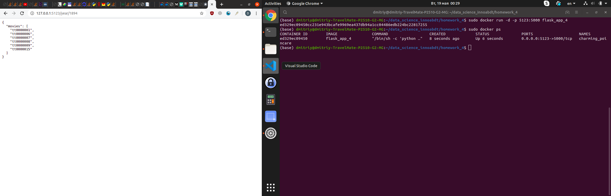

## Пример пост запроса и возвращаемый результат

## Работа с контейнером
### Сборка образа

<code>sudo docker build -t flask_app .</code>

### Запуск контейнера

<code>sudo docker run -d -p 5412:5000 flask_app .</code>

